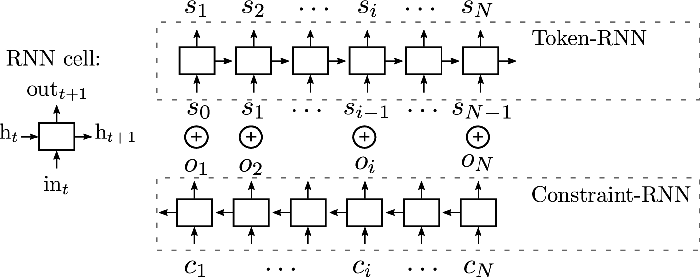

# Anticipation-RNN
Code accompanying the [article](https://link.springer.com/article/10.1007/s00521-018-3868-4)

*Anticipation-RNN: enforcing unary constraints in sequence generation,
 with
 application to interactive music generation*<br/>
 Gaëtan Hadjeres and Frank Nielsen<br/>
 Nov. 2018, *Neural Computing and Applications*, special issue on Deep learning for music and 
 audio.
 
 
 
This implementation uses Python 3.6, the PyTorch 1.0 and Music21 libraries and Musescore.
 It comes with a pretrained model.

The advantage of the Anticipation-RNN is that it can transform any RNN used for music 
generation into an
interactive generative model with little additional cost. Its inference procedure is fast so 
that it does not require dedicated computing units like GPUs. 
Anticipation-RNN works on wide variety
 of music datasets (Bach, 
Folk, Jazz, etc.) and can also cope with additional metadata (such as the current beat, current 
key, etc.).
  
Examples from the paper can be listened to [here](
https://sites.google.com/view/anticipation-rnn-examples/accueil).
 
## Usage
The `environment.yml` contains a Anaconda virtual environment you can create and load with
```
conda env create --name arnn -f environment.yml
source activate arnn
```

The command 
```
python anticipationRNN.py
```
loads the pretrained model, generates a six-bar melody using
 the set
 of 
constraints 3 from the paper (see Fig. 3) and opens the generated score in Musescore.

For other usages, check `python --help`.

All sets of contraints from the paper are available in `constraint_sets.py`.


## MuseScore integration
It should possible to call the Anticipation-RNN directly from Musescore using the
Musescore plugin file ARNNMuseScore.qml and the Flask server flask_ARNN.py.
The installation is similar to what is done [here](
https://github.com/Ghadjeres/DeepBach/tree/original_keras#musescore-plugin-and-flask-server).

## Issues
Some problems related with the display of scores in Musescore are addressed
[here](https://github.com/Ghadjeres/DeepBach).


### Cite
```
@Article{Hadjeres2018,
author="Hadjeres, Ga{\"e}tan
and Nielsen, Frank",
title="Anticipation-RNN: enforcing unary constraints in sequence generation, with application to interactive music generation",
journal="Neural Computing and Applications",
year="2018",
month="Nov",
day="20",
abstract="Recurrent neural networks (RNNs) are now widely used on sequence generation tasks due to their ability to learn long-range dependencies and to generate sequences of arbitrary length. However, their left-to-right generation procedure only allows a limited control from a potential user which makes them unsuitable for interactive and creative usages such as interactive music generation. This article introduces a novel architecture called anticipation-RNN which possesses the assets of the RNN-based generative models while allowing to enforce user-defined unary constraints. We demonstrate its efficiency on the task of generating melodies satisfying unary constraints in the style of the soprano parts of the J.S. Bach chorale harmonizations. Sampling using the anticipation-RNN is of the same order of complexity than sampling from the traditional RNN model. This fast and interactive generation of musical sequences opens ways to devise real-time systems that could be used for creative purposes.",
issn="1433-3058",
doi="10.1007/s00521-018-3868-4",
url="https://doi.org/10.1007/s00521-018-3868-4"
}
```